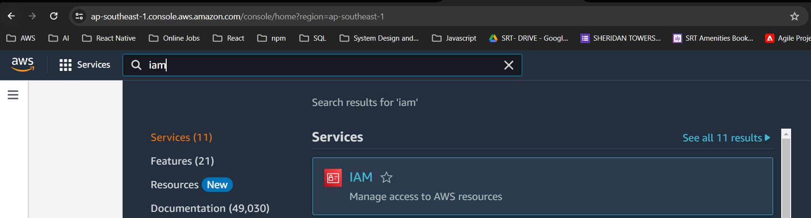
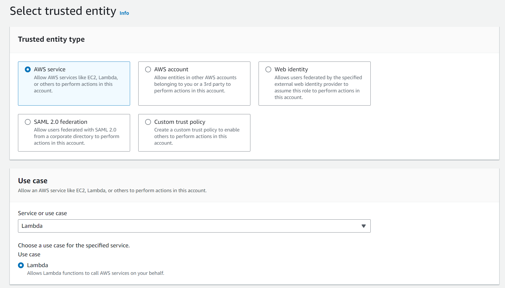
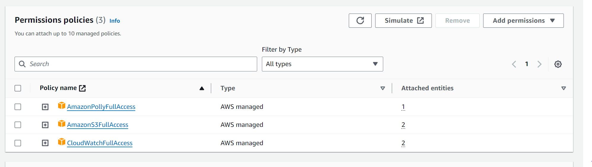
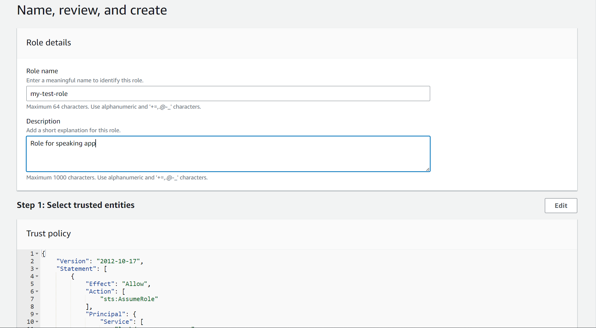
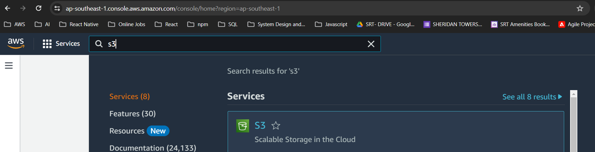

# Overview
The main function of this project is convert the input text to speech. This is made possible by utilizing the power of AWS cloud services like **Lambda**, **API Gateway**, **IAM**, **S3**, and **Polly**. I used [Serverless](https://www.serverless.com) framework as well for a hassle free back end service setup. This application's emphasis is mainly on the cloud technology side not in the UI so apologies for the very basic UI.

# Stack
In order to build this app, we've used services that are mentioned above. For the UI I used plain React.js (Vite) for a much quicker setup. All in all these are the complete lists of tools/services that I used:

1. React.js - a Javascript library used for building robust user interfaces. Any JS framework will do such as Angular, Svelte or Vue.

2. Serverless - a framework that let users build and provision cloud services easily with the help of IaaS or Infrastructure as a Service. It supports multiple cloud platforms such as Azure, AWS and GCP. It also supports multiple programming languages such as Javascript, Java and Python.

3. Lambda - is a FaaS or Function as a Service offering of AWS wherein it allows its users to build and deploy API endpoints in matter of minutes. It supports multiple programming languages, for this project I used Node.js.

4. AWS API Gateway - is a fully managed service provided by Amazon Web Services (AWS) that allows you to create, publish, maintain, monitor, and secure APIs at any scale. It acts as a gateway for your backend services, enabling you to create RESTful APIs or WebSocket APIs.

5. AWS Polly - a text-to-speech (TTS) service. Polly allows you to convert text into lifelike speech using advanced deep learning technologies. You can use it to create applications that have natural-sounding voice interfaces, or even to generate audio content for various purposes, like podcasts, automated voice responses, and more.

6. AWS IAM - AWS Identity and Access Management (IAM) is a service provided by Amazon Web Services (AWS) that allows you to manage access to AWS resources securely. IAM enables you to create and control AWS users and groups, and define their permissions to access various resources within your AWS account.

7. AWS S3 - Amazon Simple Storage Service (S3) is a scalable object storage service provided by AWS.

# Getting Started
Now we're a familiar with the tools, I wanted to guide you in building this app, if you don't want to try and develop this app you can skip this section entirely.

### AWS
In order to develop this application, we first need to register a free-tier account in AWS. All services used in this application are all under free-tier subscription. To know more go to the [official AWS website](https://aws.amazon.com/free/?gclid=Cj0KCQiAtOmsBhCnARIsAGPa5ybwSQhUI5GawhCJHxsMKy_QGknZmLZ3En2ioEMyI8pWO0hQIoZx_FkaAh_JEALw_wcB&trk=f42fef03-b1e6-4841-b001-c44b4eccaf41&sc_channel=ps&ef_id=Cj0KCQiAtOmsBhCnARIsAGPa5ybwSQhUI5GawhCJHxsMKy_QGknZmLZ3En2ioEMyI8pWO0hQIoZx_FkaAh_JEALw_wcB:G:s&s_kwcid=AL!4422!3!637354294251!e!!g!!aws%20sign%20up!19044205571!139090166850&all-free-tier.sort-by=item.additionalFields.SortRank&all-free-tier.sort-order=asc&awsf.Free%20Tier%20Types=*all&awsf.Free%20Tier%20Categories=*all). I would recommend that you create a separate IAM user under your root account because the purpose of root account is for billing and control only.

### IAM
After setting up a free-tier account and setting all appropriate account settings. Proceed to the IAM service page and create a role. You can follow this step-by-step guide:
1. Login your IAM user account.
2. Search IAM on the search bar above.



3. In the right sidebar, click **Roles**.
4. Next, click Create Role.
5. Then select AWS service and choose Lambda as the service in the dropdown below



4. Click next and add the following roles. (FullAccess for demo purposes only)



5. Click next then add the role name and description. You can add an optional tag as well at the bottom.



6. Click next and you will be redirected back to the Roles table. Click your newly created role and go in the **Summary** section and copy the arn. Save this somewhere because this will be used in the backend.

### S3
We need to create an s3 bucket for this application. This will be used to save the audio stream from **Polly** and create a pre-signed url for us to access the resource object. Here are the steps on how to create an s3 bucket.

1. Search S3 in the search bar.



2. You will then be redirected to the S3 homepage, click Create Bucket.
3. Select an AWS Region. Choose the one closest to you.
4. Input a unique bucket name.
5. Leave everything as is and click Create bucket.
6. Your S3 bucket is now created. Take note of the **bucket name**, we will be using this on the back end.


### Back End
For the backend I used the Serverless framework for a much faster provisioning of resources. Run these following commands in order

    npm install serverless -g
    serverless create --template aws-nodejs --path backend
    
This commands install the serverless framework globally then create a serverless template project called **backend**.

Go into the project directory and run `npm install`

Run these commands to install the following packages:

    npm install aws-sdk
    npm install middy
    npm install uuid
    npm i serverless-dotenv-plugin

Go to **serverless.yml** and paste this following code:

```
    service: speak-service-v2
    plugins:
      - serverless-dotenv-plugin
    useDotenv: true
    provider:
      name: aws
      runtime: nodejs20.x
      region: # Your AWS account region
      role: ${env:ROLE} // env variable called ROLE
          
    functions:
      speak:
        handler: handler.speak // the path to your function handler, since the filename in the project is handler, that means we have a speak function in the handler.js file
        name: ${sls:stage}-speak-service-v2
        events: // API Gateway
          - http: 
              path: speak
              authorizer:
                type: aws_iam // Authentication method
              method: post
              cors: true // CORS enabled
```

Create an .env file with the following variables

        ROLE= # The arn that you saved earlier after creating a role in IAM
        BUCKET_NAME= # The bucket name of the s3 that you created

For the handler code please check **/backend/handler.js**.

### Front End
Create a fresh react project. It doesn't matter if this is CRA generated or VITE the outcome is just the same.

1. Start by running:

`npm create vite@latest`

You can also run:

`npm create vite@latest my-react-app -- --template react`

Go into the project directory and run `npm install`

Run the following commands:

    npm install --save aws4-axios
    npm install axios
    npm install --save react-toastify
    npm install --save-dev vite-plugin-node-polyfills (We need this package since when using aws4-axios, the browser is throwing an exception regarding Buffer)

Since I'm using Vite here, we don't need to install additional dotenv packages as it is supported by default. Just create an .env and add these values:

    VITE_LAMBDA_URL= #Your lambda URL (You can get this after you run serverless deploy)
    VITE_ACCOUNT_REGION= #Your AWS account region
    VITE_ACCESS_KEY_ID= #Your AWS access key id
    VITE_ACCOUNT_SECRET= #Your AWS account secret
    
These values will be used for the request signing and api call.

I won't be posting the whole code here you can check **/speaking-app-fe/src** for my complete code and file structures. Also take note that I used wrapper classes for Audio and HTTPClient.

Use `npm run dev` to run the project.

I hope this documentation helps, happy learning!
